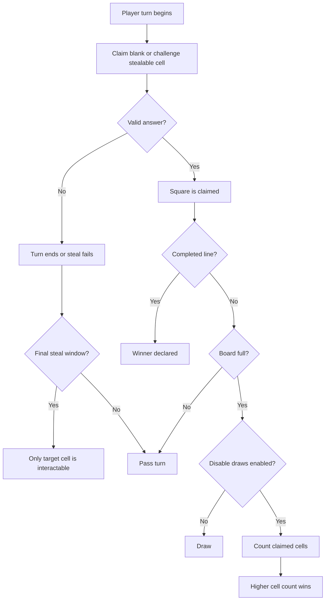

# Game Rules

## Table Of Contents

- [Modes](#modes)
- [Guess Rules](#guess-rules)
- [Daily Timing](#daily-timing)
- [Versus Rules](#versus-rules)
- [Completion States](#completion-states)
- [Achievements And Easter Eggs](#achievements-and-easter-eggs)

## Modes

### Daily

- One shared board per UTC day.
- The board is stored in Supabase and reused after the first successful generation.
- Daily progress is tied to an anonymous browser session and also mirrored locally so the current browser can restore in-progress boards quickly.
- Older stored daily boards can be opened from the daily archive later so players can catch up on missed boards, including their own saved progress for those boards when that same browser session returns.
- The archive now presents those stored boards in a calendar view, with separate cues for the board currently open and the actual current UTC daily.
- Daily completions are recorded for stats and rarity scoring.
- Daily results can surface streak progress, best streak, total daily completions, and perfect boards for that anonymous browser session.

### Practice

- Boards are generated on demand and are not stored as canonical shared puzzles.
- Practice progress is restored from local storage.
- Results are local-only and do not include daily copy/playerbase features.

### Versus

- Versus is local-only.
- State is restored from local storage.
- Players alternate turns on the same board.
- The board can surface steal opportunities, timer pressure, and end-of-match states.

## Guess Rules

- A correct answer must satisfy both its row and column categories.
- Each game can only be used once per board.
- Search selection is not the same as correctness. Correctness is decided by backend validation.
- Rejected guesses can trigger a one-time objection review per square.
- A sustained objection can promote a rejected square to correct and should preserve the judgment explanation on the guess details modal.
- If a sustained objection only rescues one side of the intersection, only that category should get the orange reviewed-success treatment; already-correct categories stay in the normal correct color.
- An overruled objection keeps the square rejected and still preserves the explanation for later review.
- Search can hide metadata that would directly overlap with the active puzzle categories.
- Same-name ports can be hidden from search when they are just duplicate clutter.
- Selected guesses can still validate against an original-plus-official-ports family when that
  makes platform or release-history matching more faithful.

## Daily Timing

- "Today" is based on UTC, using the server date string from `toISOString()`.
- Multiple users can hit the daily route at midnight UTC.
- The database unique constraint on `puzzles.date` prevents split-brain daily boards.
- There is still a small generation race where multiple requests may do expensive work before one insert wins.

## Versus Rules

### Turn Flow

- One player is active at a time.
- The turn pill should show the active player clearly without overpowering the rest of the header.
- Optional timer pressure applies only when versus timers are enabled.

### Steals

- A stealable cell can be challenged by the other player.
- Custom versus can set steals to `Off`, `Lower score`, or `Higher score`.
- Steal success is determined by the configured steal rule.
- Showdown comparisons use the game's `total_rating` when score data is available.
- Steal resolution is handled by extracted pure logic, not inline component branching.

### Objections

- Custom versus can set objections to `Off`, `1 each`, or `3 each`.
- Objection usage is tracked per player per match.
- Versus objections use a sealed review modal so the full metadata payload is not exposed mid-match.
- Standard versus defaults now use `1 each`.

### Draw Rules

- Custom versus can leave draws enabled or disable them.
- When draws are disabled, a full board with no line awards the match to the player with more claimed cells.
- Standard versus defaults start with draws disabled.

### Final Steal

- During the final steal window, only the target cell should be interactable.
- Non-target cells dim back visually.
- The target cell gets a stronger pulse so the board reads as a focused last-chance state.
- If versus alarms are disabled, the visual threat treatment should be quiet or absent.
- Versus audio now has its own toggle, so heartbeat and future sound cues can be muted independently of visual alarms.
- Standard versus defaults also start with a `5 min` turn timer and `Lower score` steals.

## Completion States

### Daily / Practice

- Completion is driven by filling the board or exhausting guesses.
- Daily results can show copy/share and playerbase features.
- Practice results stay local and simpler.

### Versus

- A match can end in an `X` win, an `O` win, or a draw.
- Custom versus can disable draws and award the match to the player with more claimed cells when a
  full board has no line.
- The winner panel should be dismissible without hiding the finished board.
- The winner panel can expand into a post-game summary with rules used, claim counts, real steal totals, review totals, score reveals, and the full list of picked games.

## Achievements And Easter Eggs

- Achievements are intentionally part of the product identity, not an afterthought.
- Hidden trigger games can unlock themed achievements.
- Example recent additions:
  - `Rub It!` for `The Rub Rabbits!`
  - `Real Stinker` for a correct answer with a sub-50 Metacritic score
