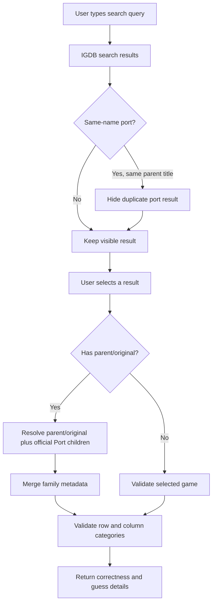

# Search And Validation

## Table Of Contents

- [Search Goals](#search-goals)
- [Search Metadata Scrubbing](#search-metadata-scrubbing)
- [Duplicate-Title Disambiguation](#duplicate-title-disambiguation)
- [Guess Validation](#guess-validation)
- [Original Plus Port Families](#original-plus-port-families)
- [Company Validation](#company-validation)
- [Count Paths](#count-paths)
- [Generation Feedback](#generation-feedback)

## Search Goals

- Make it easy to find the intended game quickly.
- Avoid accidental feel-bads where possible.
- Do not hand the player the answer.

## Search Metadata Scrubbing

When a puzzle is active, search results can scrub metadata families that overlap with the current board.

Examples:

- If `platform` is active on the board, search should not openly advertise platform metadata in the normal result row.
- If `decade` is active on the board, release date/year can be scrubbed in the normal metadata row.

This is a product choice, not just a data concern.

## Duplicate-Title Disambiguation

- Exact duplicate visible titles should be disambiguated.
- The current behavior uses `(Platform)` in the title line for duplicate results only.
- Same-name `Port` entries should be hidden when the parent/original has the same visible title.
- Ports with genuinely different titles can still stay visible.
- This is intentionally narrow:
  - exact duplicate titles in the current result set
  - not franchise-wide fuzzy grouping

Examples:

- `Super Mario Bros. (NES)`
- `Super Mario Bros. (SNES)`

## Guess Validation

- Search results are suggestions.
- Correctness is decided by backend validation against the selected cell categories.
- Validation is based on structured game data plus curated category rules.

## Original Plus Port Families

- When a selected game is validated, the backend can resolve the game as an original-plus-official-ports family.
- This family resolution is intentionally narrow:
  - the selected game
  - its original/parent game when applicable
  - official `Port` children only
- The family can contribute union metadata for validation, especially:
  - platform
  - decade via merged release dates
  - company/developer/publisher
  - other structured IGDB arrays when they differ between releases
- Family resolution follows the selected game's `parent_game` chain, not just the visible title.
- That means two results with the same title can still resolve to different families if IGDB treats them as different parent chains.
- This keeps search cleaner without forcing the player to pick a specific same-name port entry.

## Company Validation

- `Company` is union-based: a game counts if the company developed it or published it.
- Alias buckets are applied on the backend so player-facing labels can stay clean.

## Count Paths

- Native IGDB count clauses are preferred whenever possible.
- Company amalgams now use native OR-style count clauses.
- Key merged platform buckets also use native ID-backed count clauses.
- Falling back to post-filter counting is slower and should be reduced over time.

## Generation Feedback

- First validation pass shows `OK` for passing intersections.
- Failed intersections show `X` plus the failing count.
- Later metadata/counting replaces `OK` with the exact number for passed cells.

This is intentional so the player sees progress early without losing the final cell-count detail.
